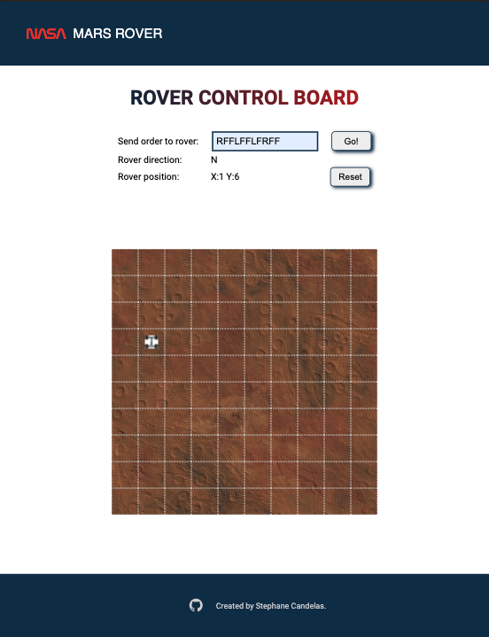

# Rover to mars

### Description

The goal for this project was to

1. move a rover inside a grid (10\*10) with the move forward (f) left (l) and (right) command
2. Right and left are actually 2 orders: one rotation that change the direction and followed by a move forward.
3. An input field is available for the user to send the orders to rover.
4. In the control board Rover direction indicate North,Est,South or West.
5. Possibility to reset the current position with the reset button.

### Overview



### Demo

[mars rover demo](https://share.getcloudapp.com/v1ub0y0w)

### Tools

For this project I used Create-react-app to speed up the development, React, and Styled-Components.
Jest and React-testing-library for the testing part.

### Available Scripts

Before you can run any scripts below install the project with the command below :

```
git clone https://github.com/stephane777/mars_rover.git
```

Once you have cloned the repo you must run the command below to install all the dependencies.

```
npm install
```

In the project directory, you can run:

```
npm run test
```

Launches the test runner in the interactive watch mode.
Unit test cover all React components.

```
npm run start
```

Runs the app in the development mode.\
Open [http://localhost:8080](http://localhost:8080/) to view it in the browser.

The page will reload if you make edits.\
You will also see any lint errors in the console.

```
npm run build
```

This will build the application for production into the dist folder.
